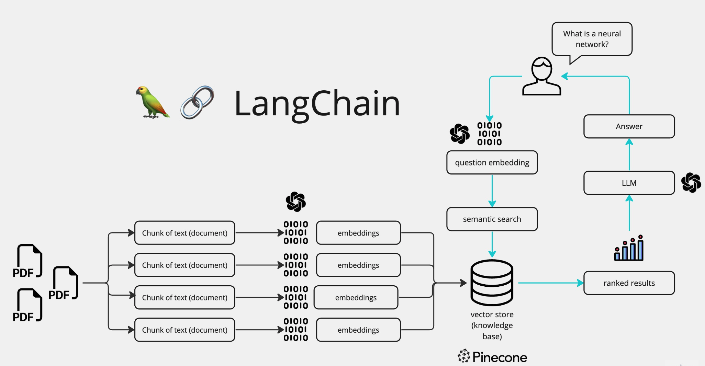
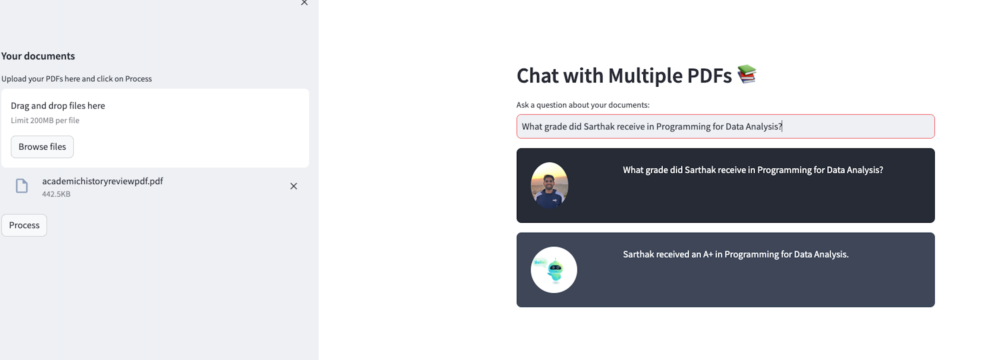

# Multiple-PDF-Chatbot

This Chatbot allows you to chat with multiple pdfs by simply uploading them. You can ask questions based on the content in the pdf and get answers using the knowledge of your PDFs. 

## Scope
Chat-GPT or other LLMs don't allow you to upload PDFs on their main website. Thus, they miss the context. Using a custom chatbot can allow you to get personalized answers. Also, there is no finetuning required for the model as we are using semantic search to get the required context.

## Tech Stack 
- Python
- Langchain
- Open-AI
- Streamlit

## How it works?

PDFs are first broken into small chunks. Then they are converted to embeddings and stored in a vector database. When a user asks a question, the question is converted to an embedding. Then, a semantic search is done between the queston and the embeddings stored in the vector database. The the LLM(GPT-4) gives us the answer using the context of the stored vectors. 

## Here's the final Webpage

